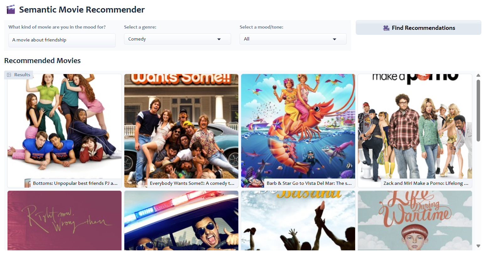

# NLP-Movies-Recommender

Goal:
We’ll be trying to use sentiment analysis to extract a ranked order for sentiments present in the movies dataset
and then match the “genres” from the initial input using a custom model. That model will then simply
attempt to match the best fitted movies from our dataset and output them as recommendations.

## Tools
- **Dataset**: A CSV of movies annotated with genre, emotion scores, and descriptions
- **Embeddings**: SentenceTransformers (`all-MiniLM-L6-v2`)
- **Vector Store**: ChromaDB for fast semantic search
- **Frontend**: Gradio

## Data Sources:
- Letterboxd (Movies Dataset) via Kaggle:
https://www.kaggle.com/datasets/gsimonx37/letterboxd?select=genres.csv

# How to run dashboard locally:
### 1. Clone the repo
git clone https://github.com/yourusername/your-repo-name.git
cd your-repo-name

### 2. (Optional but recommended) Create and activate a virtual environment
python -m venv .venv
### On Windows:
.venv\Scripts\activate
### On Mac/Linux:
source .venv/bin/activate

### 3. Install dependencies
pip install -r requirements.txt

### 4. Run the dashboard
python gradio-dashboard.py
